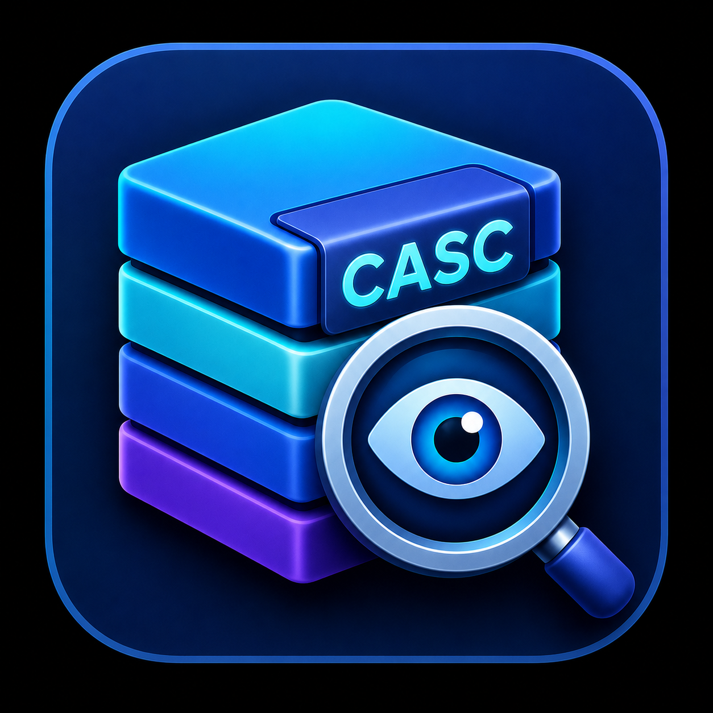
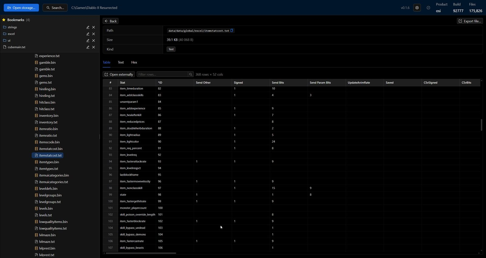
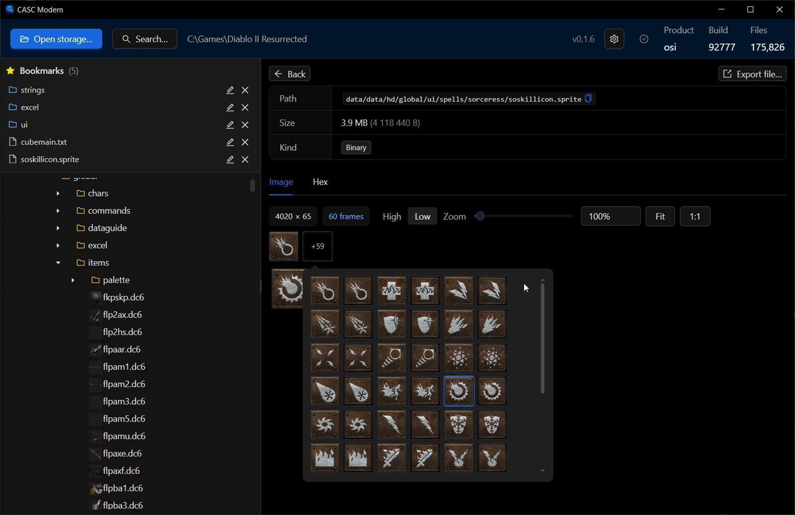
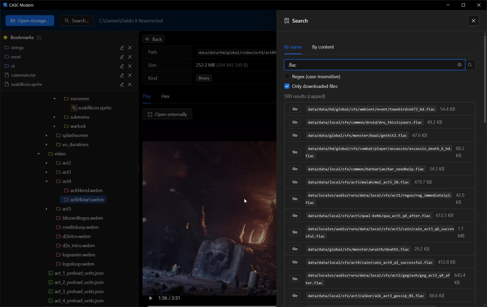

<div align="center">



# CASC Modern

[](LICENSE)
[](https://github.com/TrayHard/casc-modern/releases/latest)

</div>

A desktop browser and extractor for Blizzard CASC storages, focused on
Diablo II: Resurrected modding workflows, supposed to be an alternative to
[CascView](http://www.zezula.net/en/casc/main.html) with a modern
interface, dark theme, and additional features. Uses
[CascLib](https://github.com/ladislav-zezula/CascLib) as the underlying
engine, wrapped in a Tauri 2 frontend.

A quick but important note: the project was done mostly personally for me in Claude Code with zero knowledge in Rust (only using Rust skills for Claude), but with a wish to have the same instrument as CascView, but with a dark theme (that was the main reason :D), a search through files and a bookmarks tab.
Hopefully it would be useful for you as it was for me. If you would like to improve the project - you are welcome to create PRs or issues, just don't be too harsh please.

## Screenshots







## Overview

CASC Modern reads any local CASC storage that CascLib can open. The current
build adds a few things tailored to D2R: a viewer for `.sprite` (SpA1)
files, batch export of sprites to PNG, syntax highlighting for JSON and
text formats used by D2R Toolbox (`.model`, `.skeleton`, `.animations`,
etc.), and full-text search over the indexed content.


## Features

- Tree and table browser of the storage with lazy-loaded folders.
- Viewers selected per file kind:
  - JSON, HTML, JS, CSS, Python, plain text — CodeMirror with syntax
    highlighting, fold gutter, and `Ctrl+F` search within the file.
  - `.sprite` (SpA1) — decoded to RGBA8, displayed with zoom and a frame
    slider for animated atlases.
  - Anything else — hex viewer.
- Search by file name (substring or regex) and by file content (with a
  glob filter and per-file size cap). Both stream results.
- Export of single files or whole directories, preserving the storage
  layout. Sprite files can be exported as PNG; animated sprites split into
  one PNG per frame.
- Bookmarks for paths you visit often, persisted across sessions.
- Auto-update on installed builds: checks GitHub Releases, downloads and
  installs a signed MSI, then relaunches. Portable builds show a manual
  download link instead.

## Supported formats

Every file in the storage is readable as bytes; the table below lists the
extensions that get a viewer beyond hex.

| Extension                                                                                          | Viewer                                |
| -------------------------------------------------------------------------------------------------- | ------------------------------------- |
| `.json`, `.model`, `.skeleton`, `.animations`, `.particles`, `.physics`, `.cloth`, `.timelines`    | JSON with pretty-printing             |
| `.html`, `.js`, `.css`, `.py`                                                                      | Syntax highlight for the language     |
| `.txt`, `.frontend`, `.params`, `.fltr`, `.bat`, `.h`, `.log`, `.srt`                              | Plain text                            |
| `.sprite`                                                                                          | SpA1 decoder, RGBA8 atlas + frames    |
| anything else                                                                                      | Hex                                   |

Formats not yet decoded but present in D2R: `.dcc`, `.dc6`, `.dt1` (legacy
D2 sprites), `.texture` and `.dds` (HD textures), `.flac` (audio), `.tbl`
(string tables), `.cof` (animation defs). These currently open as hex; PRs
adding decoders are welcome.

## Install

Pre-built Windows binaries are on the
[Releases](https://github.com/TrayHard/casc-modern/releases/latest) page.

- **MSI installer** — enables in-app auto-update.
- **Portable `.exe`** — single file, no install required; updates must be
  downloaded manually.

The build is not Authenticode-signed, so Windows SmartScreen will warn on
first run. Choose "More info" → "Run anyway".

## Usage

Click **Open storage…** and pick the game install folder
(`C:\Program Files (x86)\Diablo II Resurrected` by default). CascLib walks
the directory looking for `.build.info` and the `Data/` layout; the storage
root or any subfolder works.

The last opened path is remembered and reopened automatically on the next
launch.

A `casc` CLI is also built (`crates/casc-cli`) with `info`, `list`,
`extract`, `extract-all`, and `cat` subcommands for scripting.

## Build from source

Prerequisites on Windows:

- Rust stable (≥ 1.82) — install via [rustup](https://rustup.rs/).
- Node.js 20 LTS and npm.
- Visual Studio 2022 Build Tools with the "Desktop development with C++"
  workload (MSVC + Windows SDK). CascLib is built from vendored C++
  sources by the `cc` crate.
- WebView2 Runtime (pre-installed on Windows 11 and current Windows 10).

```sh
git clone https://github.com/TrayHard/casc-modern.git
cd casc-modern
npm install
npm run tdev          # development with hot reload
npm run tbuild        # release build → target/release/
```

Linux and macOS targets compile but have not been tested against a real
storage.

## Configuration

Settings are written to `%APPDATA%\com.casc-modern.app\settings.json`:

```json
{
  "last_storage_path": "C:\\Program Files (x86)\\Diablo II Resurrected",
  "last_export_dir": "D:\\d2r-extracted",
  "recent_storages": ["..."],
  "bookmarks": [
    { "name": "Excel", "path": "data/data/global/excel", "is_dir": true }
  ]
}
```

Removing the file resets all settings to defaults.

## Project layout

```
casc-modern/
├── crates/
│   ├── casclib-sys/    # FFI bindings to vendored CascLib
│   ├── casc-core/      # safe Rust API, format decoders (e.g. spa1)
│   └── casc-cli/       # `casc` command-line tool
├── src-tauri/          # Tauri 2 backend, IPC commands
├── src/                # React 18 + Vite frontend
└── vendor/CascLib/     # vendored CascLib source (MIT)
```

Notes on the SpA1 sprite format derived from sample files are in
[`crates/casc-core/src/formats/spa1.rs`](crates/casc-core/src/formats/spa1.rs).

## Contributing

Issues and pull requests are welcome. Before submitting:

- `npm run tcheck` for the TypeScript side.
- `cargo test -p casc-core` for the Rust side.
- Match the existing commit message style (`type(scope): summary`).

New format decoders should live in `crates/casc-core/src/formats/` and be
registered in `src/components/viewers/registry.ts`.

## Acknowledgements

- **Ladislav Zezula** for [CascLib](https://github.com/ladislav-zezula/CascLib),
  the MIT-licensed C++ library that this project links against. The
  original [CascView](http://www.zezula.net/en/casc/main.html) remains the
  reference implementation for browsing CASC storages.
- **Daedrohth** for [D2RSpriteConverter](https://github.com/Daedrohth/D2RSpriteConverter),
  which demonstrated that SpA1 is decodable.
- The [Tauri](https://tauri.app), [React](https://react.dev),
  [Ant Design](https://ant.design), and [CodeMirror](https://codemirror.net)
  projects.

Full third-party notices: [NOTICE.md](NOTICE.md).

## License

MIT — see [LICENSE](LICENSE). Copyright © 2026 Poliakov Ilia (TrayHard).

---

This project is not affiliated with, endorsed by, or sponsored by Blizzard
Entertainment. Diablo® and Diablo® II: Resurrected are trademarks or registered
trademarks of Blizzard Entertainment, Inc. A legal copy of the game is required
to use this tool; the project itself ships no game assets. Screenshots in this
repository depict the tool operating on the user's own legally-obtained game
files and are shown for identification purposes only.
